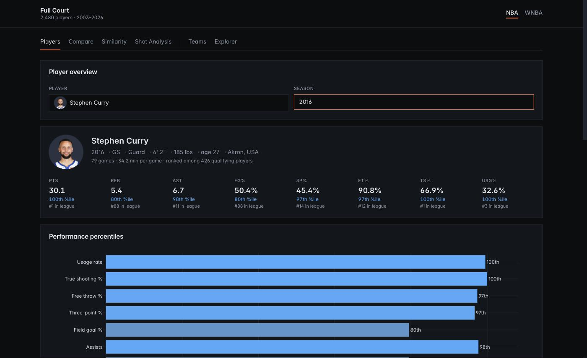

# Full Court

NBA and WNBA analytics, 2003 to now. Live at <https://full-court-six.vercel.app>



Stats side: player pages with percentiles and career trends, comparison, season
similarity, shot charts, team tables, five-player lineups, WOWY splits, player
impact ratings, and an explorer over every player-season, with counting stats on
any of four rate bases. The Ask box turns natural language questions into queries.

Predictions side: a game calendar with win probabilities and projected player
lines, Elo ratings, and a search for any player's next season.

| | NBA | WNBA |
|---|---|---|
| Game accuracy since 2015 | 65.5% | 65.8% |
| Always picking home | 56.5% | 55.3% |
| Points off by | 2.42 | 2.50 |
| Repeating last season, off by | 2.53 | 2.66 |

Season averages don't add up to a real game, so lines get refit to one: 240 team
minutes (200 in the WNBA) split by what each player earned, totals pulled toward
what teams score, anyone ruled out left out. That buys a team total that adds
up and costs about 0.2 points of per-player accuracy, which the game backtest
reports rather than hides.

## Running it

```bash
python -m venv venv && source venv/bin/activate
pip install -r requirements-local.txt
python etl/sdv_etl.py --league nba
python etl/sdv_etl.py --league wnba
python etl/schedule_etl.py
python etl/lineup_etl.py --league nba
python etl/lineup_etl.py --league wnba
cd frontend && npm install && cd ..

uvicorn backend.main:app --reload --port 8000   # one terminal
cd frontend && npm run dev                      # another, opens :5173
```

Data is ESPN's via hoopR and wehoop, about 36 MB of Parquet in `data/`, and it's
committed, so the deployed API calls nothing.

## Worth knowing

- NBA seasons are labelled by the year they end, WNBA by their own: `2024` is
  2023-24 in one, 2024 in the other.
- ESPN publishes no possession data, so ortg/drtg/pace are estimated with
  Oliver's formula rather than counted. Player stats can be read per game, per
  36 minutes, or per 75 or 100 possessions; the possession bases inherit that
  estimate twice over, since a player's possessions are his minutes times his
  team's pace and the box scores cannot say whether he played faster or slower
  than his team. Changing the basis moves percentiles and ranks too, not just
  the number shown.
- It publishes no impact metric either — no BPM, no RPM — so the Impact page
  computes its own, and offers five ways to rank: a one-season RAPM, the same
  fit over a rolling three seasons, a version shrunk toward what the box score
  predicts rather than toward average, Hollinger's PER, and raw on-off. LEBRON,
  EPM and DARKO are deliberately absent: they need player-tracking inputs ESPN
  does not publish, so anything here wearing those names would be this app's own
  metric in borrowed clothes. The possession-level ones are built from the
  rebuilt stints. Every stint becomes two observations,
  one per direction of play: the five attacking carry +1 in their offensive
  column, the five defending -1 in their defensive column, against points
  scored per 100 possessions. That gives each player an offensive and a
  defensive number that read the same way (positive is good) and add up to his
  total, plus a home-court term so the advantage isn't charged to whoever
  happened to be playing at home. The fit is ridged toward zero by a penalty
  fixed per league — re-choosing it each season would leave every season on a
  scale of its own, and the NBA needs a heavier hand than the WNBA because five
  times the possessions constrain it far less. Postseasons are fit separately
  where they are long enough to hold a rating, which no WNBA one is. It covers
  the same seasons the lineups do.
- The lineup table stores every five a team used, not just the ones that
  lasted. The tail is most of the rows and little of the time, but it is what
  makes the WOWY splits exact: each possession belongs to exactly one
  five, so any group of players is answered by adding up the fives containing
  them, and the combinations come out exhaustive. Dropping the tail would bias
  every "without" bucket toward the starters. Those splits are raw — no
  adjustment for teammates or opponents, which is what the Impact page is for.
- It publishes no lineup data either, but it does publish substitutions, so
  lineups are rebuilt by walking them. `--validate` checks the rebuilt minutes
  against the box score: they land within a minute for 99.5% of NBA
  player-games in 2025, falling to 92% in 2015 as the older feeds log a third
  fewer subs. The WNBA feed is unusable before 2020 and near-perfect after, so
  the two leagues start in different years. Fives that played under five
  minutes together aren't stored.
- Shot charts can be drawn from the regular season, the playoffs or both, and
  the league averages a player is measured against move with that choice.
  Everything else in the app is regular season only.
- The injury feed is a snapshot with no history, so it decides who plays but
  can't be backtested, and rookies have nothing to project from.
- Similarity scores cluster in the high 90s: trust the order, not the number.
